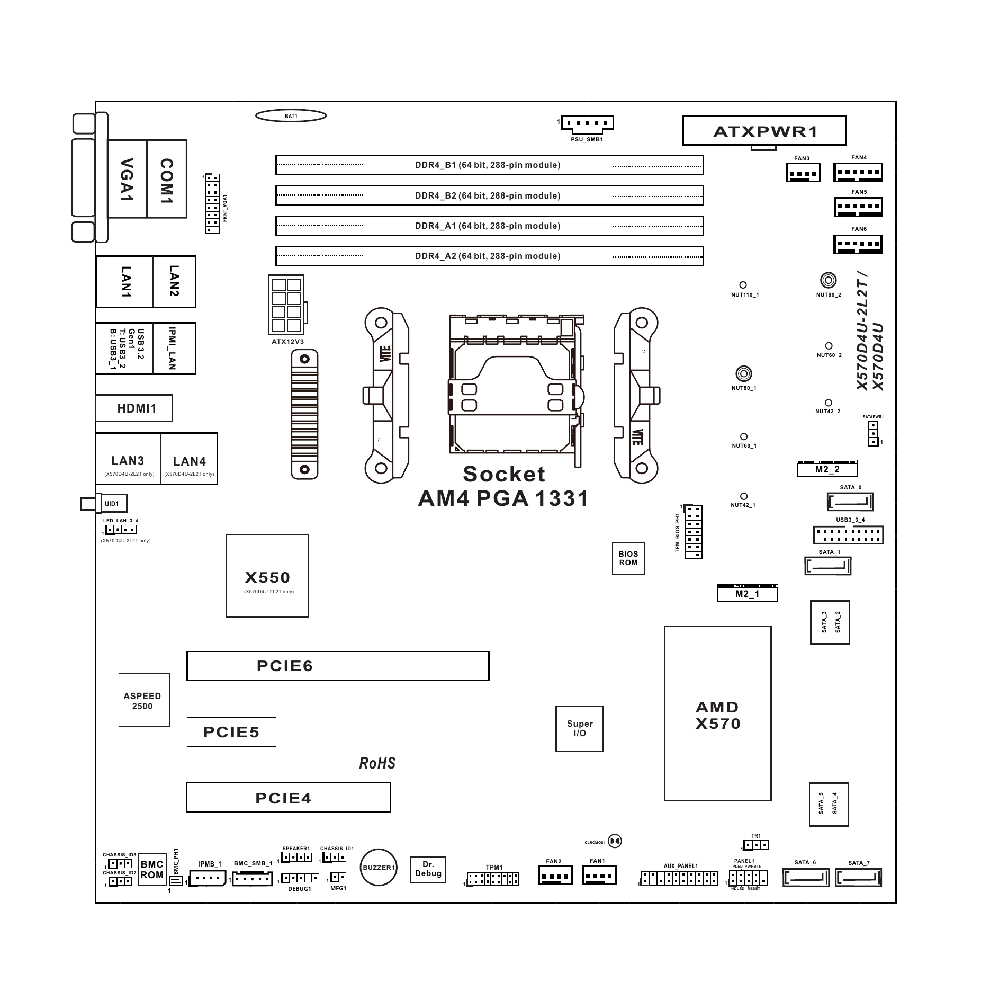
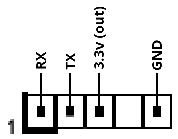
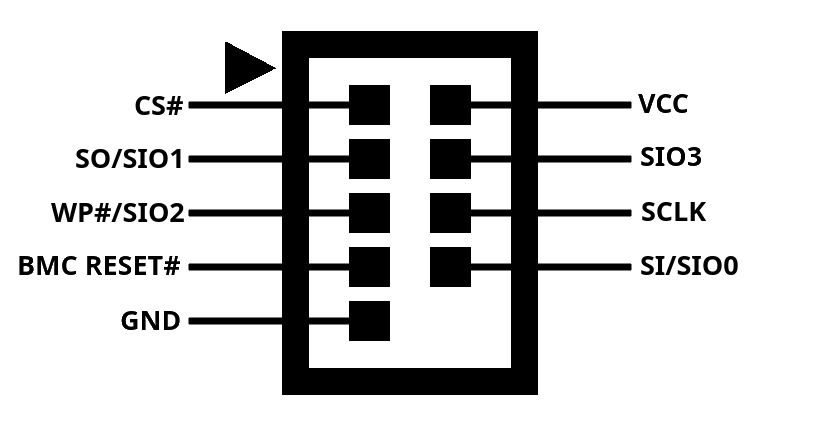
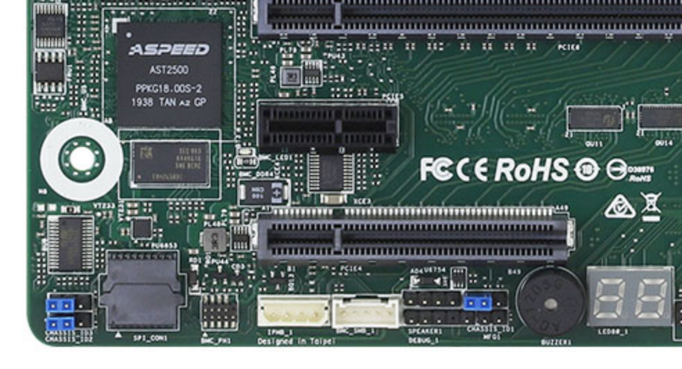

# Asrock rack X570D4U

## Connectors

The manual for the mainboard covers most of the IO on the board. This section describes some of the undocumented connectors.

### BMC debug header (BMC_DEBUG1)

This header provides a 3.3v level serial port which allows direct access to the bootloader and Linux OS on the AST2500 BMC.

### BMC programming header (BMC_PH1)

This header provides access to the flash chip of the BMC.

Connecting the `BMC RESET#` pin to `GND` disables the AST2500, allowing an exernal programmer to reprogram the flash chip without removing it from the socket.

## Technical information

### BMC

 - Flash: MX25L51245G (64MB)
 - RAM: K4A4G165WE 4Gb (512MB) DDR4 SDRAM

